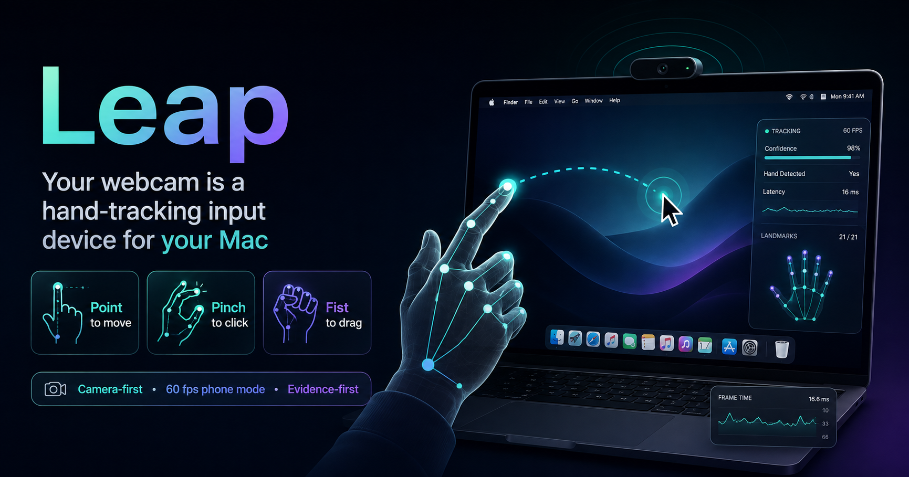

# Leap



**Your webcam is a hand-tracking input device for your Mac** — for the things
a mouse cannot do while your hands are somewhere else. Thumbs-up opens the
mic, ILY submits, a peace sign pastes, and framing a rectangle with both hands
screenshots that region to the clipboard. The built-in camera is the daily
driver, with no setup and no special hardware anywhere; any faster camera
slots in, including your iPhone over WebRTC as a built-in 60 fps mode.

The hand deliberately does **not** drive the cursor. That was the original
build and it is all still here behind `--legacy`, but a mouse points better,
and every hard problem in this repo — projection drift, phantom clicks,
transition jitter — lived in the pointing path. What is left is the part that
earns its keep.

Touchless mice are a graveyard of demos that feel magical for ten seconds and
unusable for ten minutes. Leap is an attempt to find out why, and to fix it
with measurement instead of taste: every threshold — the pinch distance, the
clutch debounce, the gain curve, the finger count that lifts the cursor — was
fitted from recorded hand data. It grew out of a Leap Motion Controller
experiment (111 fps infrared, still supported, still the precision
benchmark); the center of gravity is now the visual pipeline.

## Quick start

```bash
uv venv --python 3.12 .venv
VIRTUAL_ENV=$PWD/.venv uv pip install -e '.[dev,camera]'
curl -L --create-dirs -o vendor/hand_landmarker.task \
  "https://storage.googleapis.com/mediapipe-models/hand_landmarker/hand_landmarker/float16/latest/hand_landmarker.task"

.venv/bin/leapinput --source camera                     # dry-run first
.venv/bin/leapinput --source camera --tutorial          # guided practice room
.venv/bin/leapinput --source camera --backend quartz    # drives the real cursor
```

Face the camera; the view is mirrored — move right, cursor goes right. Add
`--preview` for a live window with the hand skeleton and gesture readout.
Then fit it to your hand (`calibrate` for thresholds, `reach` for the box the
screen lives in) — [docs/calibration.md](docs/calibration.md).

Always-on, once it's good enough to live with:

```bash
scripts/leapctl on          # detached; leapctl off / status / log
scripts/leapctl on --source phone     # opt in to the phone/WebRTC source
nohup .venv/bin/leapinput-menubar >/dev/null 2>&1 &   # ✋ one-click menu bar switch
scripts/install-menubar-app.sh        # ... or as an app that can start at login
```

The `.app` wrapper is not just packaging: macOS attributes the Camera grant to
the app that starts the process tree, so the bundle is what System Settings
lists and what has to declare `NSCameraUsageDescription`. Built by hand without
it, **Turn on** starts a session that opens a camera which never delivers a
frame — see [docs/troubleshooting.md](docs/troubleshooting.md).

The menu bar's **Turn on** always starts the built-in camera — nothing
listens on the LAN unless you ask. **Use phone camera** is the explicit
opt-in: it starts (or switches to) the WebRTC source and copies the stream
URL to the clipboard for the phone to open.

ILY on your cursor hand (or `leapctl pause`) pauses and resumes in-band.

Accuracy is measured, not felt: every session serves a scored bench at
`http://127.0.0.1:8788/bench` — a draw-this-rectangle test for framing, and a
target ladder for `--legacy` clicking, with the live mapping printed beside
the score. See [docs/troubleshooting.md](docs/troubleshooting.md).

## The vocabulary

**The hand does not drive the cursor.** Your mouse does that better. This is
for the things a mouse cannot do while your hands are somewhere else:

| Pose | Action |
|---|---|
| thumbs-up | mic ON (chime); thumbs-up again = OFF |
| ILY on your other hand | Enter — submit what you dictated |
| V sign (peace) | Cmd+V |
| frame a rectangle with both hands | screenshot that region → clipboard |
| ILY on your cursor hand | pause / resume everything |

Either hand fires the mic, paste and frame shot; ILY is the one pose that
differs by hand. `--legacy` brings back the full cursor-driving tool —
pointing, clicking, dragging, copy, Mission Control — unchanged.

The full tables, the routing guards, the corpus verification and the whole
`--legacy` vocabulary are in [docs/vocabulary.md](docs/vocabulary.md).

## Why it holds up

- **Verified against a corpus, not a demo.** 3,639 recorded frames of real
  use replay through the pipeline in CI; each pose does exactly one thing.
  328 hardware-free tests run in under six seconds.
- **Designed to fail safe.** Dry-run by default; a separate guard process
  releases every button if the main process dies — even to `SIGKILL`; every
  tracking-loss, stall, and crash path reaches the same release.
  [docs/troubleshooting.md](docs/troubleshooting.md)
- **Evidence-first diagnostics.** Every session serves a live telemetry
  dashboard (`http://127.0.0.1:8788`) and records every click with its
  surrounding 2s signal window — phantom clicks get tagged, then fixed from
  data.
- **Latency-engineered.** The phone path was audited down to aiortc's source;
  receiver patches worth ~17 ms/frame, measured. [docs/sources.md](docs/sources.md)

## Docs

| Doc | What |
|---|---|
| [docs/architecture.md](docs/architecture.md) | The pipeline diagram, layer rules, module layout, stack |
| [docs/vocabulary.md](docs/vocabulary.md) | Full gesture/command tables, routing guards, the four hardest-won numbers |
| [docs/calibration.md](docs/calibration.md) | Tutorial, threshold fitting, the reach box, touch mapping |
| [docs/sources.md](docs/sources.md) | Webcam vs phone vs Leap; the phone/WebRTC path and its latency work; setup pins |
| [docs/troubleshooting.md](docs/troubleshooting.md) | Doctor/viz/record, the telemetry dashboard, the safety model |
| [docs/context/](docs/context/) | Durable measured facts: [interaction model](docs/context/interaction.md) · [environment](docs/context/environment.md) · [testing](docs/context/testing.md) · [latency research](docs/context/latency-research-2026-08-18.md) · [strengthening](docs/context/strengthening-2026-08-18.md) · [hardening](docs/context/hardening-2026-08-19.md) · [edge reach](docs/context/edge-reach-research-2026-08-19.md) · [phantom clicks](docs/context/phantom-clicks-2026-08-19.md) |
| [docs/plan.md](docs/plan.md) · [docs/oss-dossier.md](docs/oss-dossier.md) | Build plan · OSS survey |
